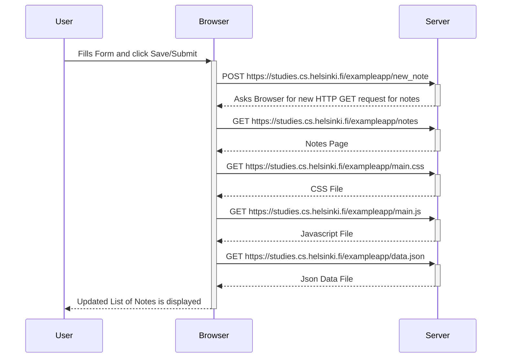

```mermaid
sequenceDiagram
    participant User
    participant Browser
    participant Server
    User->>+Browser: Fills Form and click Save/Submit
    Browser->>+Server: POST https://studies.cs.helsinki.fi/exampleapp/new_note
    Server-->>-Browser: Asks Browser for new HTTP GET request for notes
    Browser->>+Server: GET https://studies.cs.helsinki.fi/exampleapp/notes
    Server-->>-Browser: Notes Page
    Browser->>+Server: GET https://studies.cs.helsinki.fi/exampleapp/main.css
    Server-->>-Browser: CSS File
    Browser->>+Server: GET https://studies.cs.helsinki.fi/exampleapp/main.js
    Server-->>-Browser: Javascript File
    Browser->>+Server: GET https://studies.cs.helsinki.fi/exampleapp/data.json
    Server-->>-Browser: Json Data File
    Browser-->>-User: Updated List of Notes is displayed

```